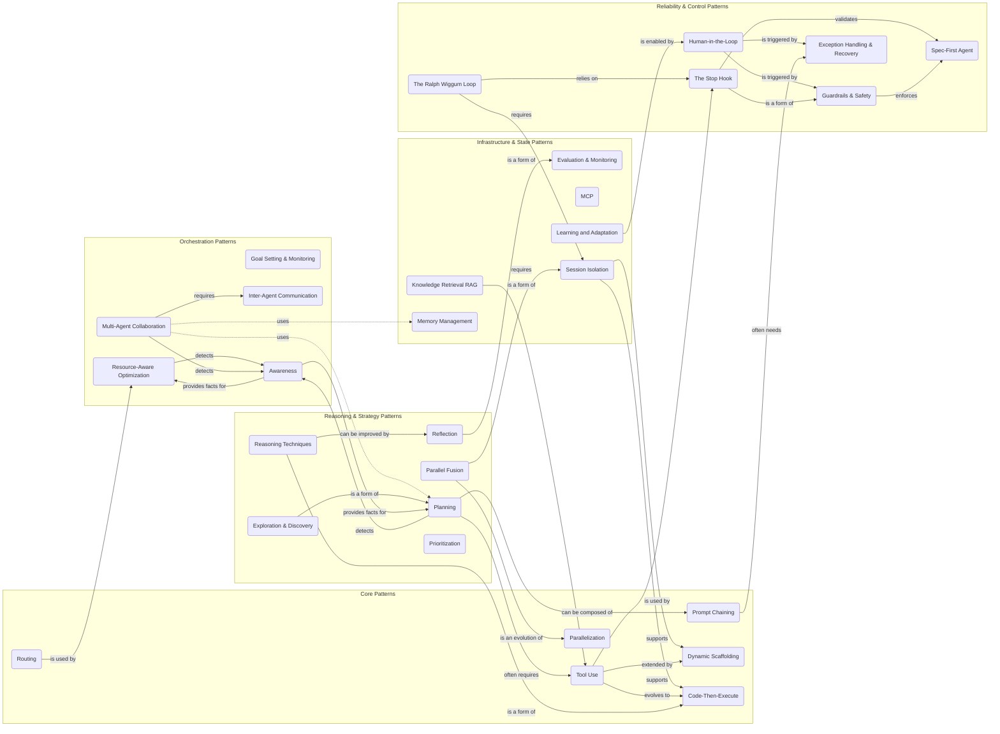

# Agentic Design Patterns

This repository contains an interactive, single-file tutorial on essential agentic design patterns for building intelligent AI systems.

## Overview

The included `index.html` file is a self-contained web page that provides a comprehensive guide to various patterns used in modern AI development. It's designed to make complex architectural concepts accessible through simple visual representations, detailed explanations, and real-world examples.

### Online Use

Open https://zeljkoavramovic.github.io/agentic-design-patterns/ in your browser.

### Offline Use
Simply download the `index.html` file and open it in any modern web browser. No internet connection is required after the initial download.

## Pattern Relationships

The following diagram illustrates how different agentic patterns often connect and rely on each other. This provides a high-level view of the ecosystem.

## Patterns Included

The tutorial covers the following 29 patterns, grouped into categories:

### Core Patterns
- Prompt Chaining
- Routing
- Parallelization
- Tool Use
- Code-Then-Execute
- Dynamic Scaffolding

### Reasoning & Strategy Patterns
- Reflection
- Planning
- Reasoning Techniques
- Parallel Fusion
- Prioritization
- Exploration & Discovery

### Orchestration Patterns
- Multi-Agent Collaboration
- Goal Setting & Monitoring
- Inter-Agent Communication
- Awareness
- Resource-Aware Optimization

### Infrastructure & State Patterns
- Memory Management
- Learning and Adaptation
- Model Context Protocol (MCP)
- Knowledge Retrieval (RAG)
- Evaluation & Monitoring
- Session Isolation

### Reliability & Control Patterns
- The Stop Hook
- Exception Handling & Recovery
- Human-in-the-Loop
- The Ralph Wiggum Loop
- Guardrails & Safety
- Spec-First Agent

## License

MIT License - Use this tutorial accordingly!

## Support the Project

If this project has helped you, support is most welcome:

- ⭐ **Star the repository** to show your appreciation.
- 💬 **Spread the word** about this repository.

## Credits

The patterns and diagrams are distilled from extensive research on agentic AI systems. For more information visit the following links:

- https://github.com/promptadvisers/agentic-design-patterns-docs
- https://www.amazon.com/Agentic-Design-Patterns-Hands-Intelligent/dp/3032014018
- https://www.researchgate.net/publication/238675575_Brahms_A_multi-agent_modelling_environment_for_simulating_work_processes_and_practices
- https://agentic-patterns.com
- https://ghuntley.com/ralph/
- https://x.com/bcherny/status/2007179832300581177
- https://github.com/guardrails-ai/guardrails
- https://medium.com/@dtunai/mastering-git-worktrees-with-claude-code-for-parallel-development-workflow-41dc91e645fe
- https://www.youtube.com/watch?v=-WBHNFAB0OE&t=685s
- https://arxiv.org/abs/2406.00832
- https://arxiv.org/pdf/2203.11171v4.pdf
- https://arxiv.org/pdf/2410.09342.pdf

Special thanks to user Thaddy from the Lazarus forum for pointing out the Brahms research.