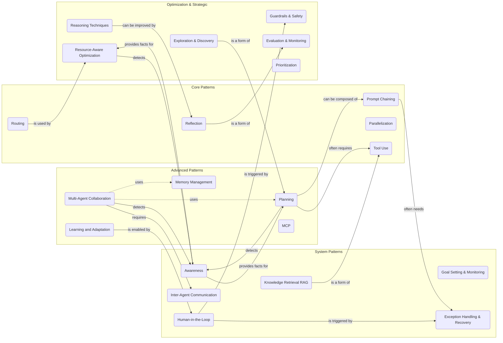

# Agentic Design Patterns

This repository contains an interactive, single-file tutorial on 22 essential agentic design patterns for building intelligent AI systems.

## Overview

The included `index.html` file is a self-contained web page that provides a comprehensive guide to various patterns used in modern AI development. It's designed to make complex architectural concepts accessible through simple visual representations, detailed explanations, and real-world examples.

### Online Use
Open https://zeljkoavramovic.github.io/agentic-design-patterns/ in your browser.

### Offline Use
Simply download the `index.html` file and open it in any modern web browser. No internet connection is required after the initial download.

## Pattern Relationships

The following diagram illustrates how different agentic patterns often connect and rely on each other. This provides a high-level view of the ecosystem.

## Patterns Included

The tutorial covers the following 21 patterns, grouped into categories:

### Core Patterns
- Prompt Chaining
- Routing
- Parallelization
- Reflection
- Tool Use

### Advanced Patterns
- Planning
- Multi-Agent Collaboration
- Memory Management
- Learning and Adaptation
- Model Context Protocol (MCP)

### System Patterns
- Goal Setting & Monitoring
- Exception Handling & Recovery
- Human-in-the-Loop
- Knowledge Retrieval (RAG)
- Inter-Agent Communication
- Awareness

### Optimization Patterns
- Resource-Aware Optimization
- Reasoning Techniques
- Guardrails & Safety
- Evaluation & Monitoring

### Strategic Patterns

- Prioritization
- Exploration & Discovery

## License

MIT License - Use these patterns freely in your projects!

## Support the Project

If this project has helped you, support is most welcome:

- ⭐ **Star the repository** to show your appreciation.
- 💬 **Spread the word** about this repository.

## Credits

The patterns, diagrams, and explanations are sourced from the excellent work done by Prompt Advisers. For more information and to view the original source files, please visit their GitHub repository:

[https://github.com/promptadvisers/agentic-design-patterns-docs](https://github.com/promptadvisers/agentic-design-patterns-docs)

For those who want to dig much deeper, their work is based on a book from Antonio Gulli:

https://www.amazon.com/Agentic-Design-Patterns-Hands-Intelligent/dp/3032014018
